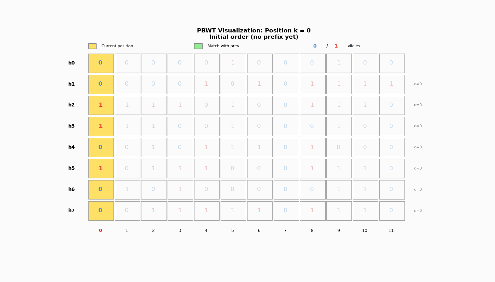

# PBWT Tutorial

An interactive visualization of Richard Durbin's Positional Burrows-Wheeler Transform (PBWT) algorithm for haplotype matching.

## Overview

This project creates animated visualizations showing how the PBWT algorithm works, inspired by Figure 1 from the original paper:

> Durbin R. "Efficient haplotype matching and storage using the positional Burrows-Wheeler transform (PBWT)" *Bioinformatics* 2014;30(9):1266-72. [DOI: 10.1093/bioinformatics/btu014](https://doi.org/10.1093/bioinformatics/btu014)

## Visualization



The animation shows:
- **Yellow cells**: Current position k being processed
- **Green cells**: Matching prefix regions with the previous sequence in sorted order
- **Blue 0 / Red 1**: Allele values
- **Gray ?**: Future positions not yet revealed
- **d values**: Divergence (position where match with previous sequence starts)

## How PBWT Works

The PBWT maintains haplotypes sorted by their **reversed prefixes** at each position. The key insight is that updating the sort order from position k to k+1 only requires a stable partition by the allele value at position k - sequences with 0s come first, then sequences with 1s, preserving relative order within each group.

This enables:
- O(NM) construction time for M haplotypes with N sites
- O(NM) algorithm to find all maximal matches (vs O(NM²) for naive pairwise)
- Highly compressible representation due to run-length encoding

## Installation

```bash
# Using conda (recommended)
conda activate base
pip install numpy matplotlib pillow

# Or using pip directly
pip install numpy matplotlib pillow
```

## Usage

```bash
# Basic usage - creates animation with 8 haplotypes, 12 sites
python pbwt_animation.py

# Custom haplotype panel
python pbwt_animation.py -n 10 -s 15 --seed 123

# Save individual frames as PNG files
python pbwt_animation.py --frames-only

# Verbose output showing sort order at each step
python pbwt_animation.py --verbose

# Change animation speed (frames per second)
python pbwt_animation.py --fps 2 -o my_animation.gif
```

### Command Line Options

| Option | Description | Default |
|--------|-------------|---------|
| `-n, --haplotypes` | Number of haplotypes | 8 |
| `-s, --sites` | Number of variant sites | 12 |
| `--seed` | Random seed for reproducibility | 42 |
| `-o, --output` | Output filename | pbwt_animation.gif |
| `--fps` | Frames per second | 1 |
| `--frames-only` | Save individual PNG frames | False |
| `-v, --verbose` | Print PBWT state at each position | False |

## Example Output

```
Haplotype Panel:
-----------------------------
h0: 0 0 0 0 0 1 0 0 0 1 0 0
h1: 0 0 0 0 1 0 1 0 1 1 1 1
h2: 1 1 1 1 0 1 0 0 1 1 1 0
h3: 1 1 1 0 0 1 0 0 0 1 0 0
...

PBWT Sort Order at Each Position:
Position k=3:
  Sort order a[k]: [0, 1, 6, 4, 7, 5, 2, 3]
  Divergence d[k]: [3, 2, 1, 3, 0, 0, 0, 0]
```

## References

- [Original Paper (PMC)](https://pmc.ncbi.nlm.nih.gov/articles/PMC3998136/)
- [Durbin's PBWT Implementation (GitHub)](https://github.com/richarddurbin/pbwt)

## License

MIT License
